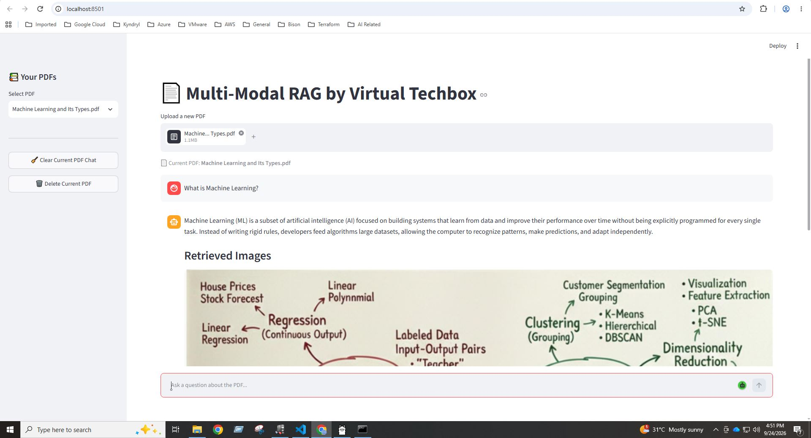
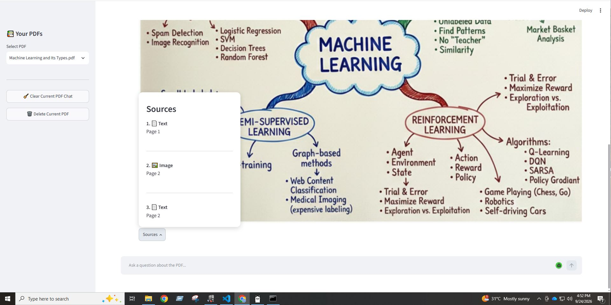
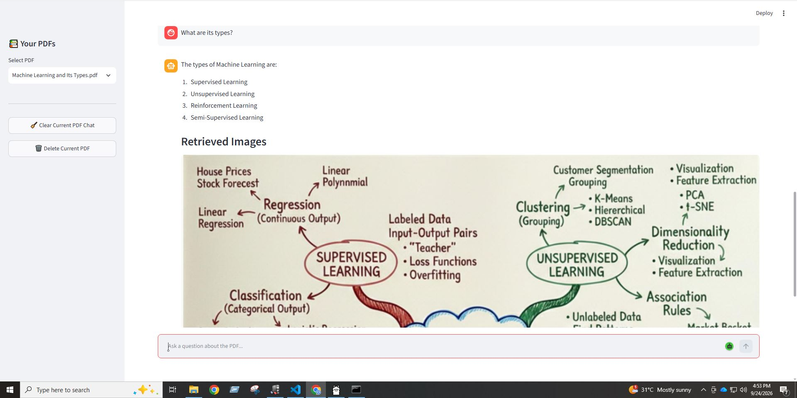
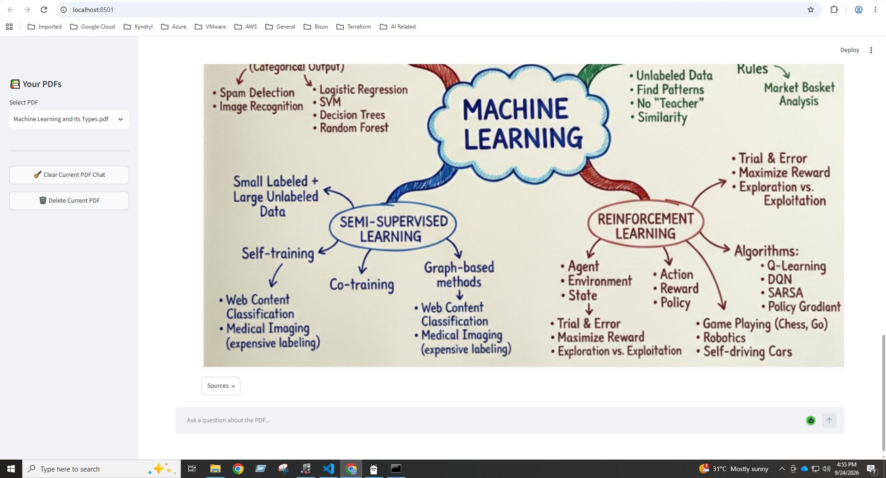

# 📄 Multi-Modal RAG by Virtual Techbox

A persistent, multi-modal Retrieval-Augmented Generation (RAG) system that allows users to chat with their PDF documents. Unlike standard RAG systems, this project handles text, tables, and images, providing a comprehensive understanding of the document's visual and textual content.

## 📸 Screenshots

<p align="center">
  
  
  
  
</p>

## 🚀 Features

- **Multi-Modal Extraction**: Extracts text, tables (as HTML), and images from PDFs using `Unstructured`.
- **Intelligent Summarization**: Uses GPT-4o-mini to generate concise summaries of text, tables, and images to optimize retrieval.
- **Visual Retrieval**: Not only retrieves text but also identifies and displays relevant images from the PDF in the chat.
- **Source Attribution**: Provides a "Sources" popover showing exactly where the information came from (e.g., 📄 Text — Page 2, 📊 Table — Page 4, 🖼️ Image — Page 5).
- **Full Persistence**:
    - **PDFs**: Uploaded documents are stored locally.
    - **Vector Store**: FAISS indices are persisted to disk, avoiding re-processing of the same PDF.
    - **Document Store**: Parent documents (originals) are stored using pickle for high-fidelity retrieval.
    - **Chat History**: Individual chat histories are maintained for each PDF, allowing you to resume conversations after a refresh.
- **Interactive UI**: Built with Streamlit for a seamless chat experience with sidebar PDF management.

## 🛠️ Tech Stack

- **LLM**: OpenAI GPT-4o-mini (via `langchain-openai`)
- **Framework**: LangChain
- **Vector Database**: FAISS
- **PDF Parsing**: Unstructured
- **Frontend**: Streamlit
- **Embeddings**: OpenAI Embeddings

## 📦 Installation

1. **Clone the repository**:
   ```bash
   git clone <repository-url>
   cd RAG-Project-5
   ```

2. **Create a virtual environment**:
   ```bash
   python -m venv venv
   # Windows
   .\venv\Scripts\activate
   # macOS/Linux
   source venv/bin/activate
   ```

3. **Install dependencies**:
   ```bash
   pip install -r requirements.txt
   ```

4. **Set up environment variables**:
   Create a `.env` file in the root directory and add your OpenAI API key:
   ```env
   OPENAI_API_KEY=your_openai_api_key_here
   ```

## 🏃 Usage

1. **Run the application**:
   ```bash
   streamlit run app.py
   ```

2. **Using the app**:
   - **Upload**: Use the sidebar to upload a PDF. The system will process it and build a persistent RAG index.
   - **Chat**: Ask questions about the document in the chat interface.
   - **Explore Sources**: Click the "Sources" button on the assistant's response to see the page numbers and content types used to generate the answer.
   - **Manage PDFs**: Switch between previously uploaded PDFs or delete them via the sidebar.

## 🗺️ System Architecture

```text
PDF Upload 
    ↓
Unstructured Partitioning (High-Res Strategy)
    ↓
Separate into: [Text] [Tables] [Images]
    ↓
Summarization (LLM) ──────────────────┐
    ↓                                 ↓
FAISS Vector Store (Summaries)    Parent DocStore (Originals)
    ↓                                 ↓
MultiVectorRetriever <────────────────┘
    ↓
History-Aware Retrieval
    ↓
Multimodal Prompt (Text + Images)
    ↓
LLM Generation → Final Answer + Images + Source Metadata
```

## 📂 Project Structure

- `app.py`: The Streamlit frontend and session management.
- `multimodel_rag.py`: The core RAG logic, including extraction, summarization, and retrieval chains.
- `requirements.txt`: Project dependencies.
- `rag_storage/`: Directory for persisted data (PDFs, FAISS indices, and docstores).
